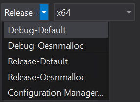
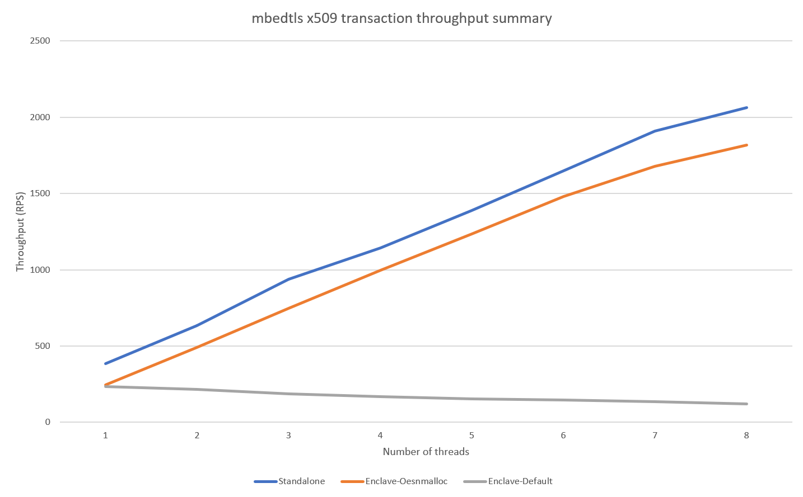

# Overview

**TLDR; If writing multi-threaded code for an Open Enclave SDK SGX enclave, be sure to use the snmalloc memory allocator.**

This directory contains test code that measures the multi-threaded throughput performance of the following mbedtls X.509 certificate methods in both an Open Enclave SGX enclave and standalone:
* [mbedtls_x509_crt_init](https://tls.mbed.org/api/group__x509__module.html#ga016dd06bc770e77b84005f305df20ed1)
* [mbedtls_x509_crt_parse](https://tls.mbed.org/api/group__x509__module.html#ga033567483649030f7f859db4f4cb7e14)
* [mbedtls_x509_crt_verify_with_profile](https://tls.mbed.org/api/group__x509__module.html#gaf044a51e5b5bc854bf12aeeccb440e55)
* [mbedtls_x509_crt_free](https://tls.mbed.org/api/group__x509__module.html#gab33c1e4e20bea7ce536119f54a113c6b)

## Enclave hosted testing

The enclave hosted testing code is located in the following subdirectories:
* `test.shared.lib` - helper library for testing
* `mbedTlsTestEnclave` - OE SGX enclave (mbedtls X.509 certificate calls made here)
* `test.enclave` - application that runs the test (via calling the OE SGX enclave)

## Standalone testing (not enclave hosted) 

The standalone testing code is located in the following subdirctories:
* `test.shared.lib` - helper library for testing
* `mbedtls-2.25.0` - a copy of the latest mbedTLS source code
* `test.standalone` - application that runs the test (mbedtls X.509 certificate calls made here)

## Build Configurations
There are two different memory allocators available for Open Enclave SGX enclaves:
* `dlmalloc` - the default memory allocator
* `snmalloc` - an alternate memory allocator ([that can be plugged in](https://github.com/openenclave/openenclave/tree/master/samples/pluggable_allocator))

The results of the perf tests in this folder show that the **default memory allocator does not scale for multi-threaded scenarios** (e.g. implementing a cloud service call in an SGX enclave).  However, the snmalloc memory allocator does scale pretty linearly for multi-threaded scenarios.

To control which memory allocator is used when running the `test.enclave` application, choose desired build configuration in Visual Studio:

## Results

The results described in this section reflect running the tests on an 8 core Azure Confidential Compute VM (*Standard DC8_v2 (8 vcpus, 32 GiB memory)*).  Since this configuration has 8 available cores, the tests were run with thread counts from 1 to 8.

As the chart below shows, the default memory allocator used for Open Enclave SGX enclaves should not be used for multi-threading scenarios since this memory allocator actually decreases in throughput whenever more than one thread is active.

The measurements show:
* `Standalone` - throughput is higher than within an enclave and scales linearly as additional threads are added
* `Enclave-Default` - thoughput starts less than standalone and goes **down** as additional threads are added
* `Enclave-Oesnmalloc` - thoughput is less than standalone, but scales linearly as additional threads are added

