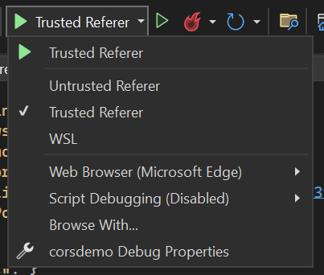
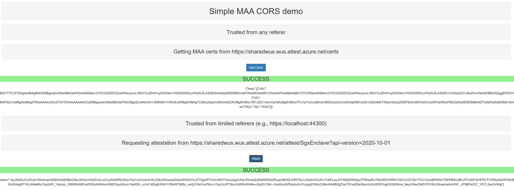
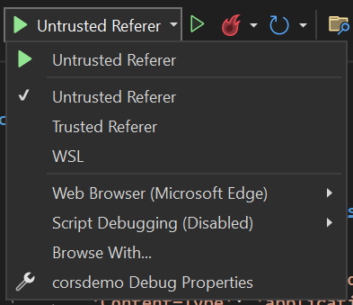
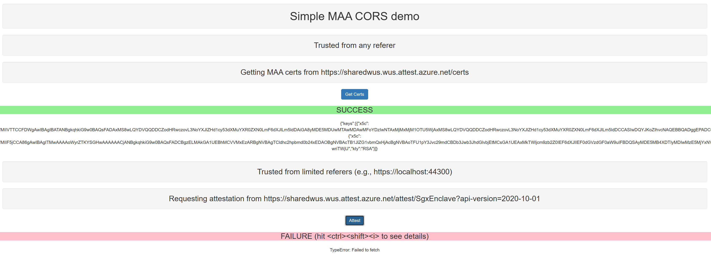

## MAA CORS Demo

### Overview

By default, web browsers forbid cross-origin requests to any REST based service, including the [MAA attestation service](https://learn.microsoft.com/en-us/azure/attestation/overview).  The MAA service leverages [CORS](https://en.wikipedia.org/wiki/Cross-origin_resource_sharing) to enable browsers to make cross-origin requests for a subset of the REST APIs.  Specifically, requests are allowed for:
* the REST API's required to verify attestation results (e.g., retrieve trusted signing certificates)
* a limited set of trusted domains (e.g., https://locahost:44300 -- useful for local development work)

### Details

This project contains a simple ASP.NET Core web service with a single HTML page with embedded Javascript that demonstrates the above.  To run the sample, launch Visual Studio with the solution file.

#### Trusted Environment 

In Visual Studio:

* launch the app using the "Trusted Referer" configuration, which runs locally at port 44300

* click the **Get Certs** and **Attest** buttons
* observe the results of success requests to MAA

#### Untrusted Environment 

In Visual Studio:

* launch the app using the "Untrusted Referer" configuration, which runs locally at port 44200

* click the **Get Certs** and **Attest** buttons
* observe the results of success requests to MAA

