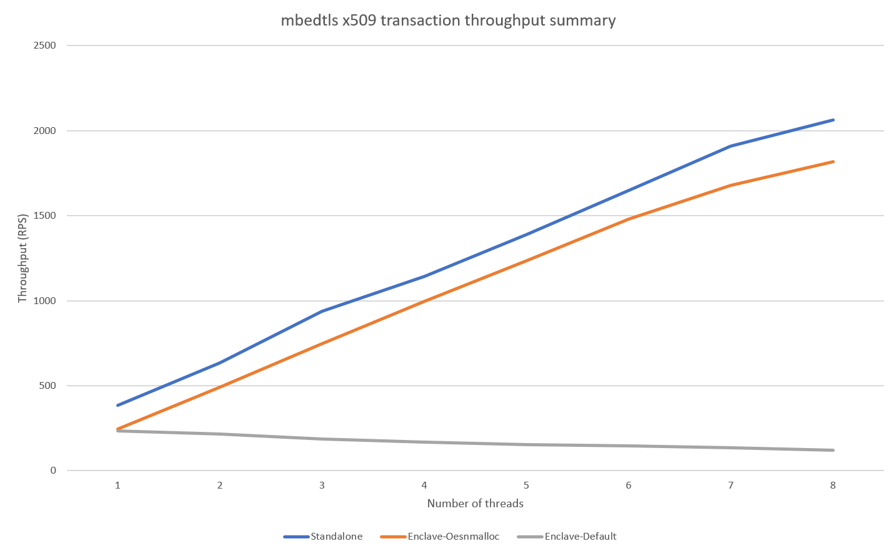

# Overview
This directory contains test code that measures the multi-threaded throughput performance of the following mbedtls X.509 certificate methods in both an Open Enclave SGX enclave and standalone:
* [mbedtls_x509_crt_parse](https://tls.mbed.org/api/group__x509__module.html#ga033567483649030f7f859db4f4cb7e14)
* [mbedtls_x509_crt_verify_with_profile](https://tls.mbed.org/api/group__x509__module.html#gaf044a51e5b5bc854bf12aeeccb440e55)
* [mbedtls_x509_crt_free](https://tls.mbed.org/api/group__x509__module.html#gab33c1e4e20bea7ce536119f54a113c6b)

## Enclave hosted testing

The enclave hosted testing code is located in the following subdirectories:
* `test.shared.lib` - helper library for testing
* `mbedTlsTestEnclave` - OE SGX enclave (mbedtls X.509 certificate calls made here)
* `test.enclave` - application that runs the test (via calling the OE SGX enclave)

## Non enclaved hosted testing

The standalone testing code is located in the following subdirctories:
* `test.shared.lib` - helper library for testing
* `mbedTLS` - a copy of the latest mbedTLS source code
* `test.standalone` - application that runs the test (mbedtls X.509 certificate calls made here)

## Results

As of 2/25/2021, the following are the observed throughput measurements for 1 to 8 threads on an 8 core Azure VM (Standard DC8_v2 (8 vcpus, 32 GiB memory)).

Throughput is less inside an enclave.  Furthermore, throughput scales fairly linearly outside of an enclave, but decreases as additional threads are run simultaneously within an OE SGX enclave.

## Results for OE SGX hosted test

Thread Count|Total Time|Total Count|Total RPS|RPS Per Thread
------------|----------|-----------|---------|--------------
1| 6.039748| 1448| 239.745118| 239.745118
2| 6.047441| 1389| 229.683927| 114.841964
3| 6.053710| 1158| 191.287644| 63.762548
4| 6.045945| 1032| 170.692919| 42.673230
5| 6.053979| 941| 155.434952| 31.086990
6| 6.063380| 871| 143.649252| 23.941542
7| 6.074773| 825| 135.807542| 19.401077
8| 7.047542| 872| 123.731084| 15.466386

## Results for standalone test

Thread Count|Total Time|Total Count|Total RPS|RPS Per Thread
------------|----------|-----------|---------|--------------
1| 6.021911| 2323| 385.757949| 385.757949
2| 6.033962| 3814| 632.088833| 316.044417
3| 6.062153| 5691| 938.775305| 312.925102
4| 6.051773| 6915| 1142.640347| 285.660087
5| 6.057184| 8416| 1389.424502| 277.884900
6| 6.066533| 10010| 1650.036274| 275.006046
7| 6.043932| 11535| 1908.525932| 272.646562
8| 6.841490| 14105| 2061.685393| 257.710674
